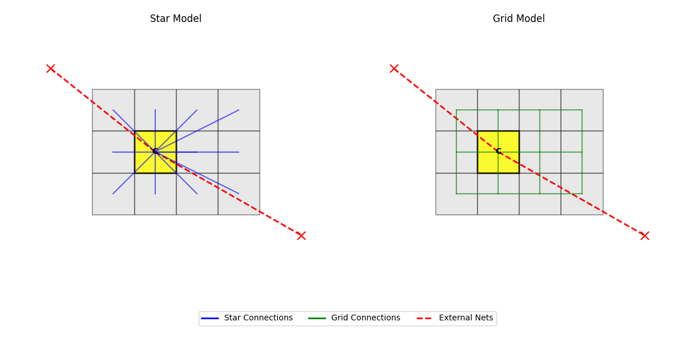

# FastPSwap

FastPSwap allocates module centroids in a netlist using Simulated Annealing to minimize Half-Perimeter Wire Length (HPWL).

## Algorithm

FastPSwap is a variant of Simulated Annealing where modules are treated as points, and their positions are swapped to minimize the total HPWL of the netlist. The process begins at a high temperature to tolerate worsening moves and escape local minima, gradually cooling down to converge on an good solution.

The heterogeneity of module sizes is an issue with this approach. Since swaps do not account for module area, by the end of the algorithm we may have a lot of overlap. To mitigate this, large modules are split into smaller submodules that can be swapped independently. Internal nets are created to connect these submodules, penalizing excessive scattering. The weights of these internal nets start low to encourage initial spreading and exploration, then gradually increase to enforce cohesion.

### Star vs Grid Model

When a module is split, "fake" internal nets are generated to keep its submodules proximal. Two connectivity models are available:

*   **Star Model (`--star 1`)**: All submodules connect to a single central submodule.
*   **Grid Model (`--star 0`)**: Submodules connect to their immediate neighbors in a grid pattern.

In both models, one central submodule anchors all original external nets. This center is chosen to minimize external HPWL and does not necessarily correspond to the geometric center of the module. All other submodules only have internal connections.

#### Stopping Criteria
Unlike standard Simulated Annealing, which typically resets the patience counter only upon finding a better global solution, FastPSwap also resets patience (extending the search) if:
*   The **average HPWL** of the current iteration improves (i.e., is lower than the best average observed so far).
*   The **spreading** of the modules improves.

#### Spreading
"Spreading" is defined as the **unweighted HPWL of all internal nets** (those connecting the submodules of a split module). Minimizing this metric ensures that the split components of a module remain reasonably close, preserving the module's locality.

#### Dynamic Weights
To enforce cohesion among split submodules, the weights of internal nets are **increased** as the temperature decreases. This strategy allows the algorithm to explore high-spreading solutions early on, before converging to low-spreading, cohesive placements as it cools.
*   **Note**: Because internal connection costs rise over time, the cost (HPWL) of the *current best solution* is dynamic and will increase as the algorithm progresses.

## Hyperparameters

| Parameter | Default | Description |
| :--- | :--- | :--- |
| `--swaps` | 100 | Number of swap attempts per module at each temperature step. Higher values increase runtime but may yield better solutions. |
| `--patience` | 20 | Number of temperature steps without improvement before early termination. |
| `--accept` | 0.5 | Initial acceptance probability for cost-increasing moves. This determines the starting temperature; higher values permit more initial exploration. |
| `--tfactor` | 0.95 | Cooling rate. Temperature is multiplied by this factor at each step. |
| `--split_net` | 0.5 | Initial weight of internal "fake" nets created by splitting, relative to the average external net weight. Set to 0 to disable splitting. |
| `--split_threshold` | 0.5 | Fraction of total movable area to split [0.0 - 1.0]. Largest modules are split until this cumulative area threshold is reached. The higher this value, the more modules are split, so the runtime increases. |
| `--star` | 1 | Connectivity model for split modules (0 = Grid, 1 = Star). |
| `--seed` | None | Random seed for reproducible results. |
